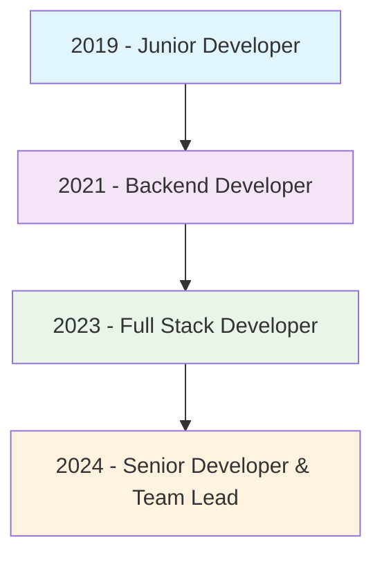

# 💫 Shakir Hussain - Full Stack Developer

<div align="center">
  
<!-- Animated Header GIF -->


<!-- Typing Animation -->
<a href="https://github.com/DenverCoder1/readme-typing-svg">
  
</a>

<!-- Animated Coding GIF -->


</div>

## 🎯 About Me


```javascript
const shakir = {
    role: "Senior Full Stack Developer",
    company: "P&P Infotech",
    code: ["JavaScript", "PHP", "Python", "SQL"],
    askMeAbout: ["Node.js", "React", "MongoDB", "System Design"],
    technologies: {
        backEnd: ["Node.js", "Laravel", "CodeIgniter"],
        frontEnd: ["React", "HTML5", "CSS3", "Bootstrap"],
        database: ["MongoDB", "MySQL", "Redis"],
        tools: ["Git", "Docker", "SharePoint", "OAuth"]
    },
    currentFocus: "Building Scalable Web Applications",
    funFact: "I debug with console.log and I'm proud of it!"
};
```

<br clear="right"/>

## 🌟 Portfolio & Projects

<div align="center">

### 💼 **Explore My Work**

<!-- Portfolio Main Button -->
<a href="https://tech-solver-toolkit.lovable.app" target="_blank">
  
</a>

<!-- Feature Buttons -->
<br><br>
</div>


## 🛠️ Tech Stack & Tools


<div align="center">

---

## 🛠️ Tech Stack & Tools

<div align="center">

### Languages & Frameworks


### Databases & Tools  


</div>

---


## 🚀 Featured Projects

<div align="center">

<!-- Project Cards with animations -->
<table>
<tr>
<td width="50%">

### 🎯 Pricing Tool (2024)


**Tech Stack:** Node.js | React.js | MySQL  
**Features:** CRM Integration, Quotes & Contracts  
**Status:** 🟢 In Production

</td>
<td width="50%">

### 📊 Algo Trading Platform (2023)


**Tech Stack:** MERN | Redis  
**Features:** Multi-broker Integration, Real-time Data  
**Status:** 🟢 Live Trading

</td>
</tr>
<tr>
<td width="50%">

### 📈 Outbook Management (2024)


**Tech Stack:** Node.js | React | SharePoint  
**Features:** OAuth, Role-based Access  
**Status:** 🟢 Active Development

</td>
<td width="50%">

### 🛒 Pagmart E-commerce (2021)


**Tech Stack:** Laravel | MySQL  
**Features:** Inventory Management, Multi-vendor  
**Status:** ✅ Completed

</td>
</tr>
</table>

</div>

---

## 📈 GitHub Analytics

<div align="center">
  


</div>

---

## 🏆 GitHub Trophies

<div align="center">
  
</div>

---

## 📊 Activity Graph

<div align="center">
  
</div>

---

## 🐍 Contribution Snake

<div align="center">
  
</div>

---

## 💼 Professional Experience

<div align="center">



</div>

---

## 🌐 Connect With Me

<div align="center">

[](mailto:shakirkhan12382@gmail.com)
[](https://www.linkedin.com/in/shakir-hussain-8a8518b7)
[](https://github.com/SHKGIT007)

</div>

---

## 💡 Random Dev Quote

<div align="center">
  
</div>

---

## 🎵 Spotify Playing

<div align="center">
  
</div>

---

<div align="center">

### 🔥 Streak Stats


### 📅 Contribution Calendar


</div>

---

<div align="center">
  
**🌟 "Code is like humor. When you have to explain it, it's bad." - Cory House**


[](https://github.com/SHKGIT007)

</div>

---

⭐️ From [Shakir Hussain](https://github.com/SHKGIT007) with ❤️


https://tech-solver-toolkit.lovable.app
